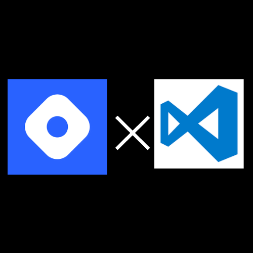

# Hashnode for visual studio code



Welcome to Hashnode for Visual Studio Code, Bringing the power of Hashnode directly to your favorite code editor! Stay connected with the latest articles, explore engaging blogs and series, and connect with your favorite authors from the comfort of VS Code.


## Installation

Download the extension from the VS Code marketplace - [Hashnode for VS code](https://marketplace.visualstudio.com/items?itemName=santhoshmani.hashnode-for-vscode)

## Features ✨

**1. Enjoy articles refined from Hashnode Feed**

**2. Step into favourite 📚 blogs & series**

**3. Visit profiles of your favourite authors📝 right from VS Code**


## Usage

- Get started by pressing  ```ctrl+shift+p``` or ```F1 key``` on windows / linux and ```cmd+p``` on mac to open command palette
- Type ```Hashnode``` to open the list of supported actions. Select the action you want to perform.


## Contributing

- Support the project by starring the repository ⭐
- Contributions to the project are welcome.
- Noticed an new issue or want to request a feature? [Open an issue](https://github.com/santhoshmani1/hashnode-for-vscode/issues/new) in the issues section.


## License

The project is licensed under the [MIT license](LICENSE.md).
